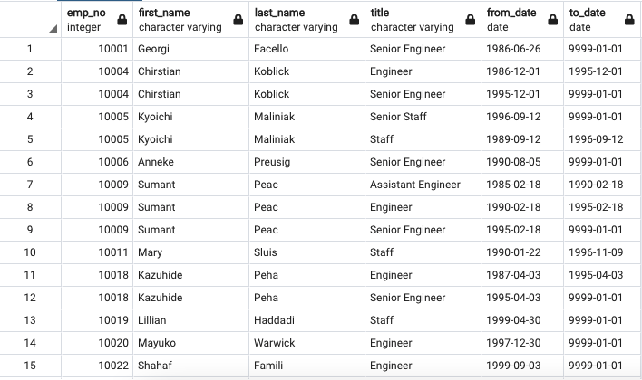
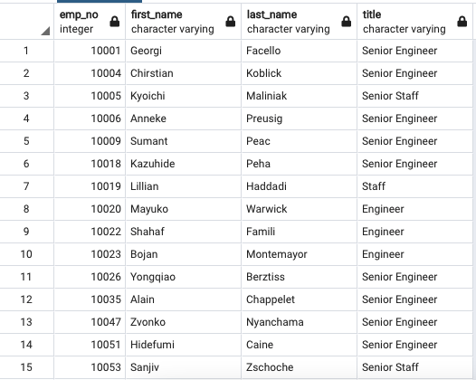
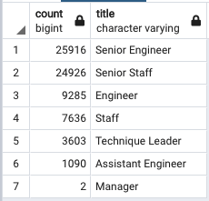
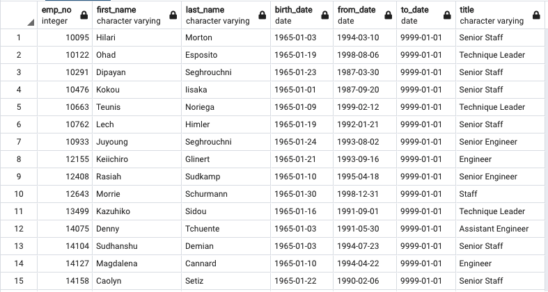
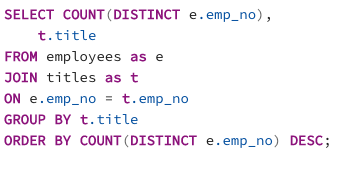
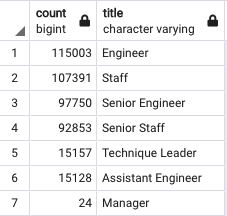
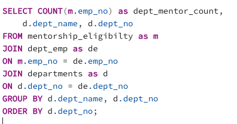
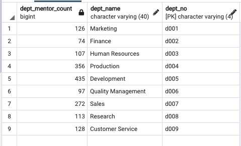
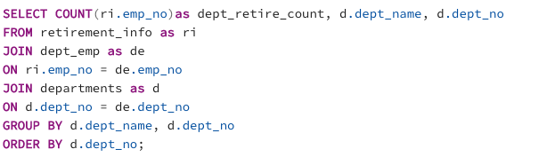
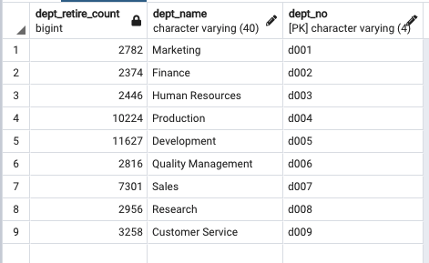

# Pewlett-Hackard-Analysis

## Overview 
Pewlett Harckard is a large company boasting several thousand employees and it's been around for a long time. The company has to prepare for the upcoming retirements of baby boomers which would potentially leave thousands of job openings. Specifically, the company has to offer retirement packages for those who meet criteria, and has to find out which positions will need to be filled in the near future. Our goal is to create a list of employee database with SQL by applying data modelling, data engineering and analysis skills to ensure a smooth transition.

For this specific deliverable, we will help the HR analyst to complete the following tasks:
1) Find out the number of retiring employees per title
2) Identify employees who are eligible to participate in a mentorship program

## Resources

- Original Company Data Source : 6 csv files
  - departments.csv
  - dept_emp.csv
  - dept_manager.csv
  - employees.csv
  - salaries.csv
  - titles.csv

- Software:
  - PostgreSQL
  - pgAdmin
  - QuickDBD

## Analysis and Results: 

### DELIEVERABLE 1:

We first created a ***retirement_titles*** table that holds all the titles of employees who were born between January 1, 1952 and December 31, 1955. Because some employees may have multiple titles in the database—for example, due to promotions— we used the ***DISTINCT ON*** statement to create a ***unique_titles*** table that contains the most recent title of each employee. Then, we used the ***COUNT()*** function to create a ***retiring_titles*** table that has the number of retirement-age employees by most recent job title.

part of retirement_titles table:

part of unique_titles table:

retiring_titles table (count of titles):

As shown above, out of the total 72458 upcoming retirees, there are:
- 25916 senior engineers
- 24926 senior staffs
- 9285 engineers
- 7636 staffs
- 3603 tecchnique leaders
- 1090 assistant engineers
- 2 managers

### DELIVERABLE 2:

We created a ***mentorship-eligibility*** table that holds the current employees who were born between January 1, 1965 and December 31, 1965. This technical analysis involved several SQL statements such as ***INNER JOIN...ON...*** for joining several tables; ***DISTINCT ON*** to retrieve the first occurrence of employee number; and ***WHERE*** to filter the specified criteria.

part of mentorship_eligibility table:

The query retrieved the employee number, employee first and last name, employee birth date, from-date (hire date for the position), to-date (end date for the position), and employee title (position) for all eligible employees. The full list is saved as ***mentorship_eligibilty.csv*** which is located in ***Data*** folder.
It has been fount that there are total **1549 employees** eligible for the mentorship program. 

## Summary: 

### Additional Suggestions  
### 1. 
Referring back to the ***retiring_titles*** table, we know that there will be nearly 72458 total vacancies that need to be filled in 3 to 4 years period as baby boomers born between 1952 to 1955 begin to retire. If we examine the count numbers more closely, a large portion of employees that are retiring are "Senior Engineers"  and "Senior Staff" which would cause the greatest vacancies. Hypothetically, 36% (or 25916 out of 72458) potential retirees are senior engineers; and 34% (or 24926 out of 72458) potential retirees are senior staff. 

In order to find out the level of impact on this and whether it is urgent to fill the roles, we have to examine the total number of such positions in the company. we could write a query to find the total number of employees for each title:

Here is the SQL Query to find total number of employees for each title:

We see the following result:

We could see that the impact of the upcoming "silver tsunami" on Senior positions are quite substancial. From simple calculation, there is 27% (25916 out of 97750) Senior Engineers and 27% (24926 out of 92853) Senior Staff are about to retire. However, there are total 115003 Engineers in the company, and only about 8% of them (or 9285) are retiring. This suggests that there are many internal oppotunities for filling in the senior vacancies.

### 2.

Another question we would want to know is whether there are enough qualified, retirement-ready employees in the departments to mentor the next generation of Pewlett Hackard employees. To be able to answer this, we first need to find out how many qualified employees (or mentors) are there for each department. Then if we assume the number of next generation employees are equal to the number of upcoming retirees,  we could compare those numbers in each department with mentor counts and find if the mentors are in a good porportion.

#### Step one:
The qualified employees or mentors are listed in our ***mentorship_eligibility*** table. From there we could simply create a relational database by joining the ***departments*** table.

The SQL Query to find the number of mentors for each department is:

We see the following result:

#### Step two:
If we assume that the number of next generation Pewlett Hackard employees are the same as the number of retiring employees (employees that have birth date BETWEEN '1952-01-01' AND '1955-12-31'AND hire date BETWEEN '1985-01-01' AND '1988-12-31'), we could simply find the number by counting the upcoming retirees in each department.  

This could be retrieved by using the query below: because the upcoming retirees are listed in the ***retirement_info***table, we could use ***JOIN*** to link the ***dept_emp*** table and ***departments*** table onto it, and use ***COUNT()*** and ***GROUP BY()*** to find the total counts.  

We see the following query result:

if comparing the numbers with the dept_mentor_count table:

  

We see that on average each eligible mentor will get assigned to onboard 20 to 30 next generation employees. Depends on actual mentorship program and its difficulty, Pewlett Hackard may have to select additional mentors to train new employees.
